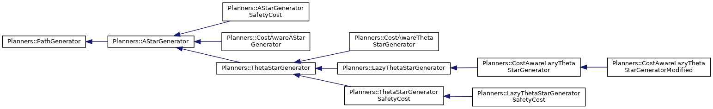

# Package Status 

This document details the features implemented in this package from a high level point of view. To code documentation is generated using doxygen which
is called from CMake. It also contains two github actions workflow to build the package for Ubuntu 18 and ROS Melodic and Ubuntu 20 and ROS Noetic each time changes are pushed to GitHub, just to check that the changes didn't break the compilation. You can check the status of the GitHub Action [here](https://github.com/robotics-upo/Heuristic_path_planners/actions) .

The package mainly contains the following elements:

1. Heuristic Algorithms
2. ROS Interface
3. Auxiliar Python Scripts
4. Extra resources like configuration files, 2D and 3D Maps, launch files etc.

## Heuristic Algorithms

The algorithms are implemented using runtime polymorphism. Inside the ```include/Planners``` you can find the headers of each algorithm. The algorithms have been implemented with a focus on code maintainability and simplicity. The class hierarchy is the following:



This allows to have a general overview of the implementation. For more details you should consider visiting the Doxygen documentation.

### Auxiliar Classes

The above classes make use of some helpers headers:

1. Discrete World: This class implements a discrete world using STL to generate the internal representation of the the desired map. It mainly contains a lot of setters and getters.

2. Heuristic Functions Header: This headers implements a static functions class which allows us to switch between different heuristics functions in runtime. Neverthless it should be refactorized with templates to allow different number of parameters

3. Utils Related Headers: These headers implements Vector, Node and other class as well as helpers functions to be used by interfaces classes. There is also a small clock class to easily profile function execution times

4. Metrics Related Headers: These headers were mainly designed to compute interesting metrics to compare algorithms and evaluate the performance and trajectory quality. 

## ROS Interface

This ROS Node was supposed to be a little demo on how to use the exposed API of the algorithms. However it has increased in size and functionalities too much. 

This node subscribes either to a 3D pointcloud or to an Occupancy Grid from ros_msgs depending on the local parameter ```use_3d``` which is a boolean. 

**Note**: When using 2D Maps and requesting paths, the Z component of the start and goal coordinates should be 0.0.

The node also advertise 2 services: 

- request_path: This service allow the user to request a path between a start and a goal point selecting the heuristic and the algorithm name from the tables below. If the algorithm and heuristic fields are leaved empty, the system will use the defaults ones passed as parameters in the launch file. The user can also set the 'tries' parameters to easily get and average of the time spent on computing the desired trajectory.

<div align="center">

| Heuristic           	| Parameter name      	|
|---------------------	|---------------------	|
| Euclidean           	| euclidean           	|
| Euclidean Optimized 	| euclidean_optimized 	|
| Manhattan           	| manhattan           	|
| Octogonal           	| octogonal           	|
| Dijkstra            	| dijkstra            	|

</div>

- set_algorithm: This service simply allows to change the current algorithm used by the Node. The possible parameters are:

<div align="center">

| Algorithm Name                   	| Service Parameter Name       	|
|----------------------------------	|---------------------------	|
| A*                                | astar                         |
| Cost Aware A*                    	| costastar                 	|
| A* Safety Cost                   	| astarsafetycost           	|
| Theta*                           	| thetastar                 	|
| Cost Aware Theta*                	| costhetastar              	|
| Theta* Safety Cost               	| thetastarsafetycost       	|
| Lazy Theta*                      	| lazythetastar             	|
| Cost Aware Lazy Theta*           	| costlazythetastar         	|
| Cost Aware Lazy Theta*  Modified 	| costlazythetastarmodified 	|
| Lazy Theta* Safety Cost          	| lazythetastarsafetycost   	|
|                                  	|                           	|
</div>

The node reads also some parameters:

- algorithm: From the table above, astar by default.
- heuristic: From the table above, euclidean by default.
- world_size_x: The X size of the inner world. This size can be smaller than the actual size of the real loaded map.
- world_size_y: The X size of the inner world. This size can be smaller than the actual size of the real loaded map.
- world_size_z: The X size of the inner world. This size can be smaller than the actual size of the real loaded map.
- resolution: The resolution you want for the inner map representation
- inflate_map: Whether to add a static inflation or not.
- inflation_size: In case you choose to inflate, set this parameter to some resolution units depending on the inflation magnitude you want. 
- use3d: This params 
- frame_id: Used for setting markers frame id for RViz.
- cost_scaling_factor: The exponential factor of the cost decay function when building a 3D Grid Cost Map.
- robot_radius: The proportion factor of the cost decay function when building a 3D Grid Cost Map.
- save_data_file: Whether to save or not interesting data for later analysis to a file
- data_folder: Folder where data will be saved
- max_line_of_sight_distance: Line of sight distance restriction. 
- cost_weight: Proportion factor that multiplies the nodes costs when adding it to distance costs
- overlay_markers: For representation purposes, allows the user to keep the trajectories markers.


**Note**: The system loads a map and uses a coordiante system with the (0,0,0) as origin and all three X,Y,Z components **positives**. 

## Auxiliar Python Scripts

In order to easily perform multiple tests over different parameters in a reproducible, friendly way, some Python scripts can be found inside the ```scripts/``` folder. Basically, they use the ROSLaunch Python API and some others rospy features to wrap a launch file to startup the system in the desired an state, and then, it iterates over a set of goals or parameters with the selected changing conditions. They are mainly used to collect data and produce some plots to get a fast overview of the algorithm behavior when one algorithm is added or modified.

To get an idea of the arguments you need to pass to them simply try to execute them without any argument and they will tell you the usage:

```bash
user@user$ ./compare_trajectories_rviz.py 
usage: compare_trajectories_rviz.py [-h]
                                    [--launch {planner2d_example.launch,plan_random_path.launch,planner.launch} [{planner2d_example.launch,plan_random_path.launch,planner.launch} ...]]
                                    --algorithm
                                    [{astar,costastar,astarsafetycost,thetastar,costhetastar,thetastarsafetycost,lazythetastar,costlazythetastar,costlazythetastarmodified,lazythetastarsafetycost} [{astar,costastar,astarsafetycost,thetastar,costhetastar,thetastarsafetycost,lazythetastar,costlazythetastar,costlazythetastarmodified,lazythetastarsafetycost} ...]]
                                    [--map-name {robbi_1.pgm,robbi_2.pgm,tunnel.pgm,test.pgm,big_lab_map_v2.pgm,big_lab.pgm,mbzirc_challenge3.bt,laberynth.bt,manufacturing.bt,two_blocks.bt,wall.bt,random3d.bt,maze.bt,random_cluttered.bt} [{robbi_1.pgm,robbi_2.pgm,tunnel.pgm,test.pgm,big_lab_map_v2.pgm,big_lab.pgm,mbzirc_challenge3.bt,laberynth.bt,manufacturing.bt,two_blocks.bt,wall.bt,random3d.bt,maze.bt,random_cluttered.bt} ...]]
                                    --start-coords START_COORDS START_COORDS
                                    START_COORDS --goal-coords GOAL_COORDS
                                    GOAL_COORDS GOAL_COORDS
                                    [--cost-value COST_VALUE]
                                    [--lof-value LOF_VALUE] [--tries TRIES]
                                    [--heuristic {euclidean,euclidean_optimized,manhattan,octogonal,dijkstra}]
compare_trajectories_rviz.py: error: argument --algorithm is required
```

As you can see, the ```compare_trajectories_rviz.py``` needs some arguments. Some of them are mandatories, to try and example just run:

```bash
./compare_trajectories_rviz.py --algorithm astar thetastar lazythetastar --start-coords 20 20 3 --goal-coords 40 40 3
```


## Extra Resources

### Launch Files

Some launch files are included for demostration purposes. 

- plan_random_path.launch: This launch demonstrates how to use a random map with two predefined empty areas for start and goal coordinates, could be useful for benchmarking and reproducibility. 

- planner.launch: Sample launch that passes the most common parameters to the planner_ros_node and launchs it

- planner2d_example.launch: Sample launch that illustrates how to launch the planner_ros_node in 2D mode with a map and a node costmap.


## TODOs, Ideas, Improvements

- [ ] Fix: To use only one algorithm, the headers of the parent algorithms should be included, this is not the most desirable behavior.
- [ ] Refactor: Create a new Grid3D class.
- [ ] Refactor: Implement a new heuristic function class with templates(variadic?) allowing multiple parameters passing .
